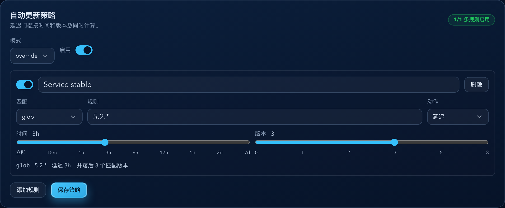
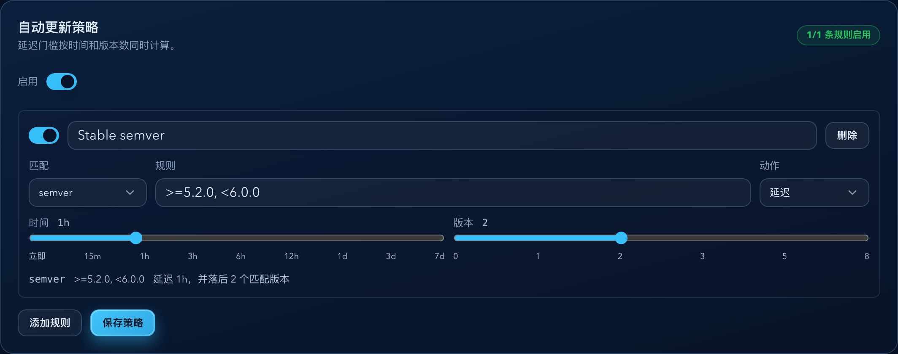

# Dockrev：自动部署策略配置器（#xyy72）

> 当前有效规范以本文为准；实现覆盖与当前状态见 `./IMPLEMENTATION.md`，关键演进原因见 `./HISTORY.md`。

## 背景 / 问题陈述

- Dockrev 已能通过定时检查和 GHCR webhook 发现服务镜像候选版本，但部署仍主要依赖人工触发。
- 运维用户需要按服务或 Stack 为候选版本设置自动部署规则，同时保留 digest lock、跨 tag 保护、备份继承和并发保护等现有更新安全边界。
- 延迟部署不能只靠时间：用户明确要求时间延迟与“落后 N 个匹配版本”两个门槛叠加，避免刚发现一个版本就因为时间到而自动更新。

## 目标 / 非目标

### Goals

- 为 Stack 和 Service 增加自动更新策略模型，Service 支持 `inherit`、`override`、`disabled` 三种模式。
- 支持 `semver`、`regex`、`glob` 三类候选版本匹配规则。
- 支持 `immediate` 与 `delayed` 两类动作；`delayed` 必须同时满足最早发现时间门槛与版本落后门槛。
- 时间与版本数使用固定非线性档位，API 只存储规范值 `minAgeSeconds` 与 `minVersionLag`。
- 自动执行只由定时检查与 GHCR webhook 检查触发，UI 手动扫描不得触发自动部署。
- 在 Service 详情页和 Stack 详情页提供紧凑策略配置器、规则预览和 Storybook 视觉证据。

### Non-goals

- 不让 UI 手动扫描自动触发部署。
- 不支持跨 tag 更新，仍只更新当前 Compose tag 对应的新 digest。
- 不引入 RBAC、多租户审批流或外部策略 DSL。
- 不把 regex/glob 用于镜像仓库名匹配，首版只匹配候选展示版本或 raw tag。

## 范围（Scope）

### In scope

- API 数据类型、持久化 schema、迁移与校验器。
- 自动策略匹配、延迟 pending 记录、定时轮询与自动 update job 入队。
- Service settings 与 Stack settings API。
- Service 详情页、Stack 详情页、Services/Operations Stack 分组入口。
- Storybook stories、mock API、交互覆盖与视觉证据。

### Out of scope

- Supervisor 自升级自动策略。
- 自动策略审批流、用户分级权限和外部通知审批。
- 跨仓库或跨镜像名匹配。
- 对非 `schedule` / GHCR webhook 检查来源的自动部署触发。

## 需求（Requirements）

### MUST

- `Service override > Service disabled > Stack policy` 是唯一有效策略优先级。
- `semver` 匹配必须使用 Rust `semver::VersionReq`，并复用现有版本解析语义。
- 匹配目标按候选展示版本优先，展示版本不可用时回退 raw candidate tag。
- `glob` 语义为 Docker tag 通配符 `*` / `?`，服务端必须转成安全 anchored regex。
- 时间滑块档位固定为 `0 / 900 / 3600 / 10800 / 21600 / 43200 / 86400 / 259200 / 604800` 秒。
- 版本滑块档位固定为 `0 / 1 / 2 / 3 / 5 / 8`。
- 服务端必须拒绝非档位值、非法 semver、非法 regex、非法 glob 和空规则。
- 自动入队 job 必须带显式 `targets[]`、`createdBy=auto-policy`、`reason=auto_policy`。
- 自动策略执行必须复用现有 digest lock、cross-tag guard、backup inherit 与 stack 并发保护。
- 自动策略必须跳过 Dockrev 自身镜像；Supervisor 自升级只能走既有专用入口。

### SHOULD

- UI 以紧凑规则列表展示，默认提供一个可直接编辑的规则。
- 配置器文案应明确“延迟需要同时满足时间和版本数”。
- Stack 分组标题应提供进入 Stack 策略详情的入口。

## 功能与行为规格（Functional/Behavior Spec）

### Policy model

- Stack policy:
  - `enabled: boolean`
  - `rules: AutoUpdateRule[]`
  - `updatedAt`
- Service policy:
  - `mode: inherit | override | disabled`
  - `enabled`
  - `rules`
  - `updatedAt`
- `inherit` 不保存 Service 本地规则为有效规则；运行时读取同 Stack policy。
- `disabled` 明确阻断 Stack policy。
- `override` 使用 Service 自身 `enabled/rules`。

### Rule model

- Rule fields:
  - `id`
  - `name`
  - `matcher: { type: semver | regex | glob, pattern }`
  - `action: immediate | delayed`
  - `delay: { minAgeSeconds, minVersionLag }`
  - `enabled`
- `immediate` 等价于 `minAgeSeconds=0` 且 `minVersionLag=0`。
- `delayed` 必须按已存储的两个 delay 值评估，不允许只满足其中一个门槛就更新。

### Matching

- 对每个检查成功后的新版本候选，先取候选展示版本，再取 raw candidate tag。
- `semver` 使用 `semver::VersionReq` 匹配解析后的版本。
- `regex` 使用服务端正则并匹配整个候选文本。
- `glob` 由服务端转成 anchored regex，`*` 匹配任意字符序列，`?` 匹配单个字符。
- 第一条 enabled 且匹配成功的规则决定动作。

### Delay gates

- 首次命中规则与候选 digest 时记录 `firstSeenAt`。
- 时间门槛：`now >= firstSeenAt + minAgeSeconds`。
- 版本数门槛：当前运行版本至少落后 `minVersionLag` 个匹配版本；`0` 表示不增加版本数等待。
- 两个门槛都满足后，自动更新到当前最新候选 digest。

### Automatic execution

- 成功完成的 check job 若来源是 `schedule` 或 GHCR webhook，触发策略评估。
- UI 手动 check、dry-run、preview 或其他来源不得触发自动部署。
- 自动部署创建 update job，并复用现有请求校验路径。
- 每个自动 job 必须使用显式 `targets[]`，禁止依赖隐式 stack/all 扫描范围。
- pending 记录必须避免同一服务、同一规则、同一候选 digest 重复入队。

### UI

- Service 详情页展示当前模式、继承来源、规则列表和保存入口。
- Stack 详情页展示 Stack 级策略配置和该 Stack 下服务列表。
- Services/Operations 的 Stack 分组标题可进入 Stack 详情。
- 非线性滑块必须显示档位 label，不使用线性数字输入作为主控件。

## 接口契约（Interfaces & Contracts）

### 接口清单（Inventory）

| 接口（Name） | 类型（Kind） | 范围（Scope） | 变更（Change） | 契约文档（Contract Doc） | 负责人（Owner） | 使用方（Consumers） | 备注（Notes） |
| --- | --- | --- | --- | --- | --- | --- | --- |
| `GET /api/services/{service_id}/settings` | HTTP | external | Modify | 本文 | dockrev-api | Web | 返回 Service 自动策略 |
| `PUT /api/services/{service_id}/settings` | HTTP | external | Modify | 本文 | dockrev-api | Web | 保存 Service 自动策略 |
| `GET /api/stacks/{stack_id}/settings` | HTTP | external | New | 本文 | dockrev-api | Web | 返回 Stack 自动策略 |
| `PUT /api/stacks/{stack_id}/settings` | HTTP | external | New | 本文 | dockrev-api | Web | 保存 Stack 自动策略 |
| `UpdateReason::auto_policy` | API enum | internal | New | 本文 | dockrev-api | updater | 自动策略创建 update job |

### JSON shape

```json
{
  "autoUpdatePolicy": {
    "mode": "override",
    "enabled": true,
    "rules": [
      {
        "id": "stable",
        "name": "Stable releases",
        "enabled": true,
        "matcher": { "type": "semver", "pattern": ">=1.0.0, <2.0.0" },
        "action": "delayed",
        "delay": { "minAgeSeconds": 86400, "minVersionLag": 2 }
      }
    ],
    "updatedAt": "2026-04-30T00:00:00Z"
  }
}
```

## 验收标准（Acceptance Criteria）

- Given Service policy 为 `disabled` 且 Stack policy 已启用，When check job 发现匹配候选，Then 该 Service 不会自动入队。
- Given Service policy 为 `inherit` 且 Stack policy 规则匹配，When 来源为 schedule 或 GHCR webhook，Then 创建 `reason=auto_policy` 且含显式 `targets[]` 的 update job。
- Given 来源是 UI 手动扫描，When 规则匹配，Then 不创建自动 update job。
- Given Stack policy 匹配 Dockrev 自身镜像，When 来源为 schedule 或 GHCR webhook，Then 不创建自动 update job。
- Given delayed 规则 `minAgeSeconds=86400`、`minVersionLag=2`，When 只有时间到或只有版本数满足，Then 不自动更新；When 两者都满足，Then 自动更新到当前最新候选。
- Given API 收到非预设档位值，When 保存策略，Then 返回校验错误。
- Given regex/glob/semver 非法，When 保存策略，Then 返回校验错误并不覆盖旧配置。
- Given 用户在 Service 或 Stack 详情页编辑规则，When 保存成功，Then 重新读取后配置完整 roundtrip。

## 验收清单（Acceptance checklist）

- [x] 核心路径的长期行为已被明确描述。
- [x] 关键边界/错误场景已被覆盖。
- [x] 涉及的接口/契约已写清楚。
- [x] 相关验收条件已经可以用于实现与 review 对齐。

## 非功能性验收 / 质量门槛（Quality Gates）

### Testing

- `cargo test -p dockrev-api`
- Backend tests cover semver/regex/glob matching, invalid rule validation, inheritance precedence, immediate vs delayed rules, time + version-lag gates, slider preset validation, duplicate prevention, stack/service auto enqueue.
- API tests prove settings roundtrip, invalid matcher errors, invalid slider rejection, and `reason=auto_policy` jobs with explicit `targets[]`.

### UI / Storybook

- `cd web && bun run lint`
- `cd web && bun run build`
- `cd web && bun run build-storybook`
- `cd web && bun run test-storybook`
- Service and Stack policy configurators have Storybook states for inherited/override/disabled, nonlinear slider labels, delayed gate copy, invalid input display.

### Integration smoke

- Shared testbox Docker/Compose smoke must exercise an auto-policy update job when feasible.

## Visual Evidence

- source_type: storybook_canvas
  target_program: mock-only
  capture_scope: element
  requested_viewport: 1440x900
  viewport_strategy: browser-resize-fallback
  sensitive_exclusion: N/A
  submission_gate: pending-owner-approval
  story_id_or_title: Pages/ServiceDetailPage/Auto Policy Override Delayed
  state: Service override delayed policy
  evidence_note: verifies Service policy override editing, delayed time/version gates, matcher controls, and nonlinear slider labels.



- source_type: storybook_canvas
  target_program: mock-only
  capture_scope: element
  requested_viewport: 1440x900
  viewport_strategy: browser-resize-fallback
  sensitive_exclusion: N/A
  submission_gate: pending-owner-approval
  story_id_or_title: Pages/StackDetailPage/Policy Enabled
  state: Stack enabled delayed policy
  evidence_note: verifies Stack policy editing, enabled policy summary, delayed time/version gates, and nonlinear slider labels.



## Related PRs

- None

## 风险 / 开放问题 / 假设（Risks, Open Questions, Assumptions）

- 假设：自动策略首版可按服务级 update job 入队，即使规则来源于 Stack policy；显式 `targets[]` 仍满足自动执行的范围透明性。
- 风险：历史候选发现记录对版本落后数量的覆盖可能受过期缓存影响，服务端必须以当前 check summary 的最新候选为准。
- 风险：regex/glob 规则若过宽，可能自动更新到用户不期望的 tag；UI 必须提供预览文案与明确 matcher 类型。

## 参考（References）

- `docs/specs/99egq-explicit-update-tag-contract/SPEC.md`
- `docs/specs/2hnkx-new-version-discovery-count/SPEC.md`
- `docs/specs/5umc8-discovery-count-timeline/SPEC.md`
