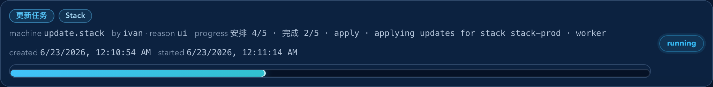
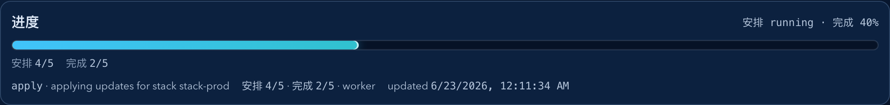
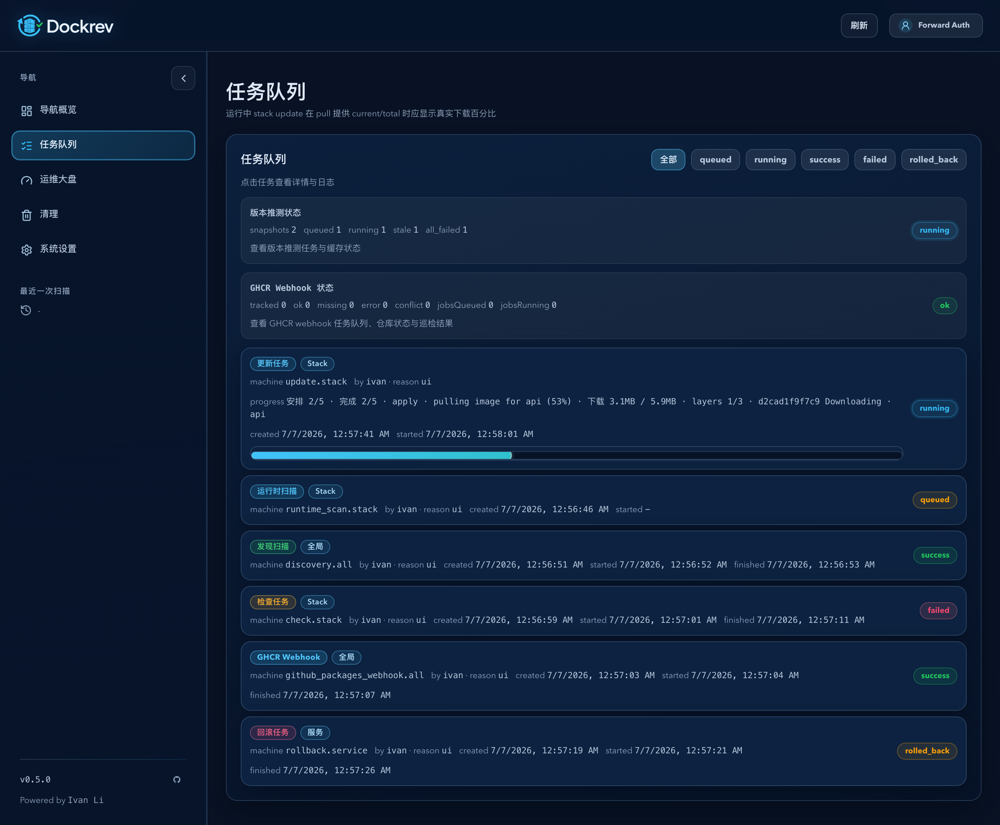
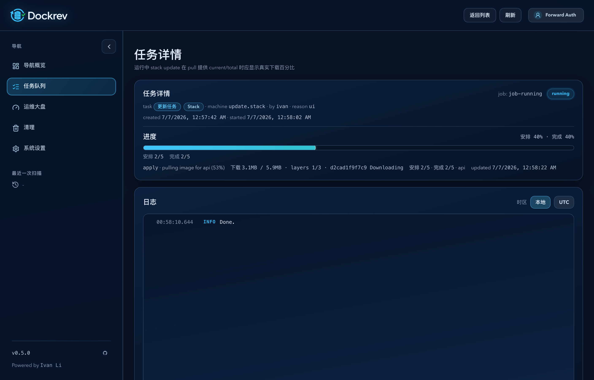
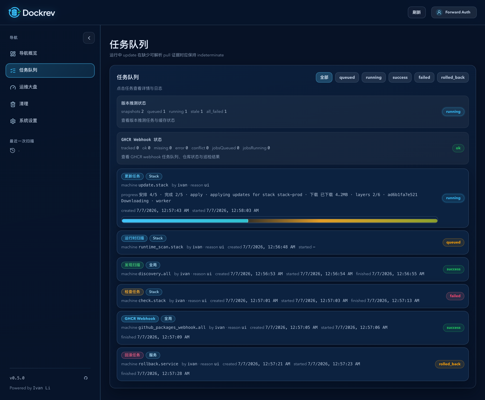
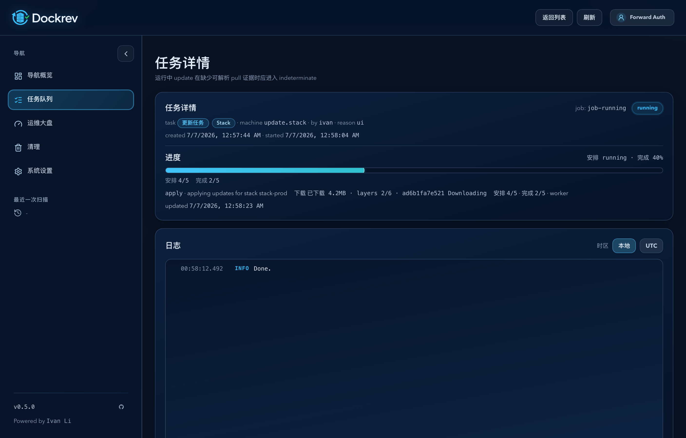
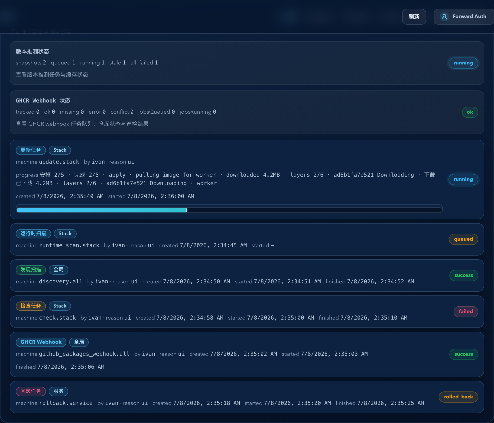
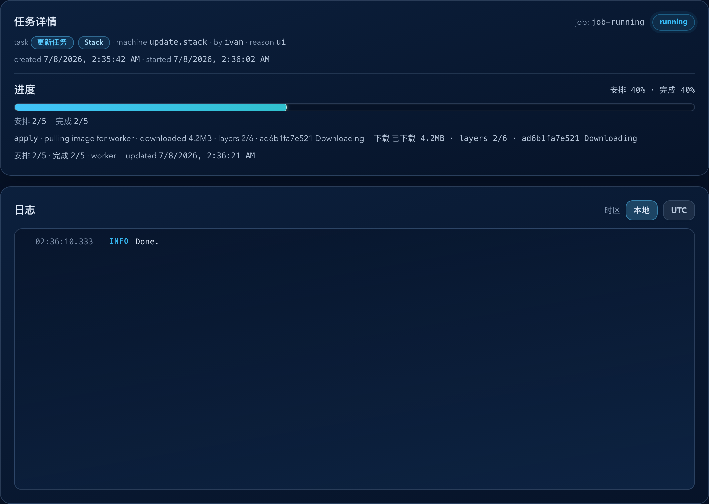

# Dockrev：固定 5 并行检查 + 双层任务进度（#yhngp）

## 状态

- Status: 已完成
- Created: 2026-02-24
- Last: 2026-07-08

## 背景 / 问题陈述

- 当前 `check all` 在镜像数量较多时体感偏慢，且任务进度难以区分“已安排”与“已完成”。
- 现有进度模型仅有单层 `current/total/percent`，在并发调度场景下无法表达调度推进情况。
- 前端任务列表与详情页仅显示单层进度条，无法同时反映调度与执行。

## 目标 / 非目标

### Goals

- `check` 任务固定为 5 并行槽位，并强制 1 秒错峰启动。
- registry per-host 并发与 check 并发对齐为固定 5，确保有效并行能力一致。
- 扩展统一 `JobProgress`：新增 `plannedCurrent/plannedTotal/plannedPercent`，保持旧字段兼容。
- `/queue` 与 `/queue/:jobId` 对 running 任务展示“安排进度 + 完成进度”双层进度条。

### Non-goals

- 不调整候选版本判定、回滚语义、registry retry 算法。
- 不引入新的数据库表或 schema 迁移。
- 不新增独立任务类型或新页面。

## 范围（Scope）

### In scope

- `crates/dockrev-api/src/api/mod.rs`
- `crates/dockrev-api/src/api/types.rs`
- `crates/dockrev-api/src/discovery.rs`
- `crates/dockrev-api/src/runtime_scan.rs`
- `crates/dockrev-api/src/config.rs`
- `web/src/api.ts`
- `web/src/pages/QueuePage.tsx`
- `web/src/pages/JobDetailPage.tsx`
- `web/src/App.css`
- `README.md`
- `.env.example`

### Out of scope

- `update` / `runtime_scan` 调度算法改造（仅进度模型对齐）。
- Deploy/Supervisor 功能改造。

## 接口与契约变更（Interfaces & Contracts）

### HTTP / SSE

- `GET /api/jobs`
- `GET /api/jobs/{id}`
- `GET /api/jobs/{id}/events`

`job_progress` 增量字段（camelCase，可选）：

- `plannedCurrent`
- `plannedTotal`
- `plannedPercent`

兼容口径：

- 既有 `current/total/percent` 继续表示“完成进度”。
- 历史 producer 若缺失 `planned*`，前端按 `planned=completed` 回退。
- 新 producer 可显式发送 `plannedPercent: null` 表示“运行中但当前无可验证计划百分比”，前端必须保留该 `null` 语义并进入 indeterminate。

## 功能与行为规格（Functional/Behavior Spec）

### Check 调度

- 并发槽固定为 `5`。
- 每次启动新 worker 前，必须满足与上次启动间隔 `>= 1s`。
- 若有已完成 worker，优先回收并更新“完成进度”，避免进度滞后。

### 进度模型

- `check`：
  - `planned*` 表示已安排（已启动）任务进度。
  - `current/total/percent` 表示实际完成进度。
- `update/runtime_scan/discovery`：
  - 默认 `planned* = completed*`，保证前端双层展示一致。
  - 例外：`stack/all update` 的 batch pull 阶段若缺少可解析中间证据，不得用 synthetic service 预推进伪造高百分比；此时允许显式发送 `plannedPercent: null`，completed `percent` 只在已验证阶段推进。
  - Docker/Compose pull 输出中，`current/total` 字节比例是最强证据；缺少总字节但存在 `completedLayers/totalLayers` 时，layers 比例可作为保守中间证据推进 pull 子阶段，且必须保持单调不减、不得伪造下载总量。

### 前端展示

- Queue 行内展示两层条：安排（上）+ 完成（下）。
- Job 详情页进度卡展示两层条与对应计数/百分比。
- 历史任务若缺失 `planned*`，前端回退为 `planned=completed`。
- 若任务显式发送 `plannedPercent: null`，UI 必须显示 running/indeterminate，而不是回退成具体数字；若后端已用真实字节或 layers 证据给出 `plannedPercent`，UI 显示确定进度，同时下载明细仍表达为 `已下载 X · layers n/m` 或 `X / Y · layers n/m`。

## 验收标准（Acceptance Criteria）

- Given 同 registry 下至少 6 个待检查服务，When 触发 `check all`，Then 在飞检查数不超过 5，且连续启动间隔约 1 秒。
- Given `check` 任务 running，When 读取 jobs API 或 SSE，Then `plannedCurrent >= current` 且两者单调递增。
- Given 任务处于 running，When 查看 `/queue` 与 `/queue/:jobId`，Then 均可见双层进度条。
- Given 历史任务无 `planned*`，When 前端渲染，Then 不报错且双层展示正常回退。
- Given `stack/all update` 的 batch pull 无可解析进展，When 读取 jobs API/SSE 或查看 `/queue` 与 `/queue/:jobId`，Then `plannedPercent` 保持 `null`，UI 进入 indeterminate，且不会在 pull 完成前虚高到 `82%` 一类已验证阶段之外的数值。
- Given `stack/all update` 的 batch pull 缺少下载总字节但持续输出 layers 完成数，When 读取 jobs API/SSE 或查看 `/queue` 与 `/queue/:jobId`，Then 主进度条随 layers 证据保守推进，下载明细不把 layers 伪装成字节百分比。

## 非功能性验收 / 质量门槛（Quality Gates）

### Testing

- `cargo test -p dockrev-api`
- `bun run --cwd web lint`
- `bun run --cwd web build`
- `bun run --cwd web test-storybook`

### Quality checks

- 新增/更新测试覆盖：并发上限、错峰启动、progress 字段与 SSE 载荷。

## Visual Evidence

## 实现里程碑（Milestones / Delivery checklist）

- [x] M1: 新增 spec 并冻结验收口径。
- [x] M2: check 固定并发 + 1 秒错峰调度落地。
- [x] M3: JobProgress 双层字段与 SSE/API 对齐。
- [x] M4: Queue/JobDetail 双层进度条完成并兼容历史数据。
- [x] M5: 验证通过并快车道交付（PR + checks + review-loop）。

## 风险 / 假设

- 风险：固定 1 秒错峰会拉长小批量任务总时长。
- 风险：外部调用方若严格校验 `job_progress` 字段白名单，可能需同步更新。
- 假设：当前部署不依赖 `DOCKREV_CHECK_CONCURRENCY` 与 `DOCKREV_REGISTRY_PER_HOST_CONCURRENCY` 的动态调参。

## 变更记录（Change log）

- 2026-02-24: 创建规格并冻结范围与验收口径。
- 2026-02-24: 完成实现与本地验证（cargo test + web lint/build）。
- 2026-02-24: 快车道交付完成（PR #90，CI 全绿，review-loop 无 P0/P1 阻塞）。
- 2026-06-22: 修正 `stack/all update` batch pull 的进度语义；无可解析 pull 证据时使用显式 `plannedPercent: null` 驱动 UI 进入 indeterminate，避免 synthetic service 预推进造成的虚高百分比。
- 2026-07-06: 增加真实 Docker/Compose pull 下载明细；共享测试机验证 service 与 stack 更新均能产生 `download.currentBytes`，缺少可证明总量时保持 indeterminate。
- 2026-07-08: 将 Docker/Compose layers 完成数纳入保守 pull 进度证据；仍优先真实字节比例，缺少任何可解析证据时继续保持 indeterminate。
